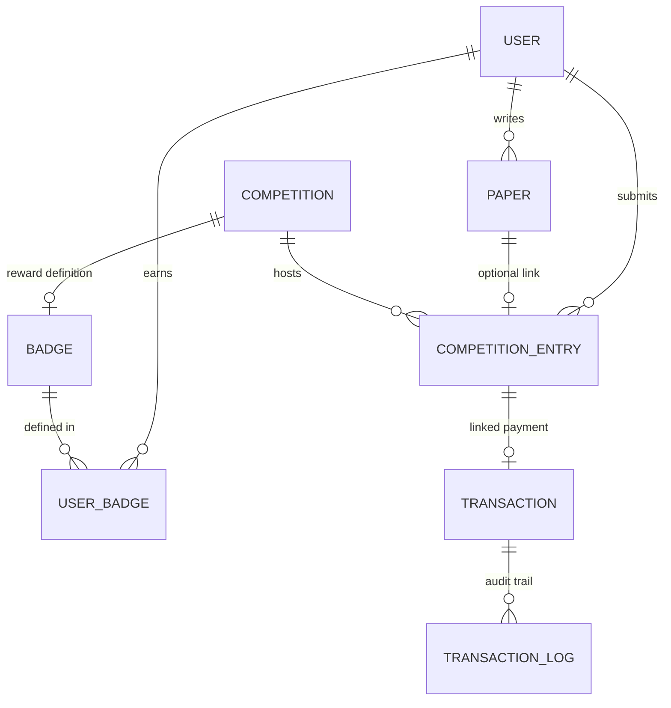

# Research: Scalable Backend Architecture & Futuristic Database Model

- **Date**: 2026-03-25
- **Status**: Research Phase
- **Target Implementation**: Task #5 (Modular Prisma Migration)

## 1. Overview
The goal of this research is to design a high-precision, scalable backend architecture for Philosophid. We focus on a modular database schema that can support thousands of users, complex publication workflows, and robust competition scoring with integrated payment and reward systems.

## 2. Recommended Infrastructure & Libraries

To ensure 100% precision and developer-friendly maintainability:

- **Database / ORM**: `Prisma` (Existing) - Use for type-safety and visual schema management.
- **Payment Processing**:
    - `Stripe API` (International): Industry standard for subscriptions and one-off entry fees.
    - `Midtrans (Core API / Snap)` (Local/IDN): Best for QRIS and local Indonesian transfers if targeting that market.
- **Authentication**: `Firebase Auth` (Existing) - Handles Google OAuth and email/password securely.
- **Validation**: `Zod` - For strict input validation on the backend and frontend.
- **Diagramming**: `Mermaid.js` - For living documentation of the schema.

## 3. Recommended Implementation Strategy

### 3.1 The "Ultimate" User Profile
The user profile should move beyond basic contact info. We propose a "Reputation & Persona" driven model.
- **Username (Unique)**: Essential for public profiles (`/{username}`).
- **Bio & Metadata**: Text-based bio plus structured data for `institution`, `birthday`, and `location`.
- **Philosophical Persona**: Fields for `favPhilosopher`, `philosophySchool`, and `interestTags`.
- **Reputation Aggregate**: A `score` field (existing) but supported by a `reputationHistory` or `stats` for more transparency.
- **Analytics-Ready**: `lastLogin`, `onboardingCompleted` (boolean), `engagementLevel`.

### 3.2 Reimagining Publications (Paper Model)
The current `Paper` model is a solid start. To make it "futuristic":
- **Polymorphism via Types**: Keep the `type` enum but consider specialized metadata blocks for each.
- **Draft Management**: Support for `versionID` or a dedicated `Draft` table if we need full revision history (though JSON `content` in `Paper` works for simple cases).
- **Relational Independence**: A publication can exist independently OR be linked to a `CompetitionEntry`. We use a 1-to-1 or 1-to-N relation depending on if one paper can enter multiple competitions.

### 3.3 Competition & Scoring Ecosystem
This is the most complex part of the backend:
- **Competition Constraints**: Each competition has exactly **one** `PaperType` (e.g., Only Articles, or Only Short Stories). This ensures focused judging and clear expectations.
- **Topics & Tags**: Competitions include `topics` (main category) and `tags` (keywords) to help users find relevant contests.
- **Scoring System**:
    - `CompetitionScoringConfig`: Defines how a competition is scored (e.g., Community 40%, Judges 60%).
    - `Score`: A table linking `Judge`, `CompetitionEntry`, and `ScoreValue`.
- **Flexible Badge Rewards**:
    - Winners are awarded badges from the existing `Badge` table.
    - Each competition can define its own unique `badgeId` reward for the winner, allowing for total flexibility.

### 3.4 Payment & Transaction Flow (Scalability)
- **Status**: The current `Transaction` model is good.
- **Enhancement**: Add a `Wallet` table or a `TransactionType` (enum: `COMPETITION_FEE`, `WITHDRAWAL`, `DONATION`) for modularity.
- **Webhook Security**: Ensure `TransactionLogs` catch every status change from the gateway.

### 3.5 Modular Prisma Architecture (Task #5)
The schema will be split into:
1. `base.prisma`: Enums and Shared Utils.
2. `user.prisma`: User, Badge, UserBadge.
3. `publication.prisma`: Paper, Comment (Future).
4. `competition.prisma`: Competition, CompetitionEntry, Scoring.
5. `payment.prisma`: Transaction, TransactionLog.

## 4. Proposed Schema (Simplified ERD)

## 5. Security & Precision Considerations
- **Concurrency**: Use database transactions for entry submissions to prevent double entries or race conditions in paid competitions.
- **Data Integrity**: Enforce `@@unique([userId, paperId, competitionId])` to ensure a user only enters a specific paper once into a specific competition.
- **Auditability**: Every change to sensitive fields (role, score, status) should ideally be logged.

## 6. Next Steps
- Implement modular Prisma structure in Task #5.
- Update `User` table with missing "futuristic" fields.
- Refactor `Paper` and `Competition` relationships for better flexibility.
