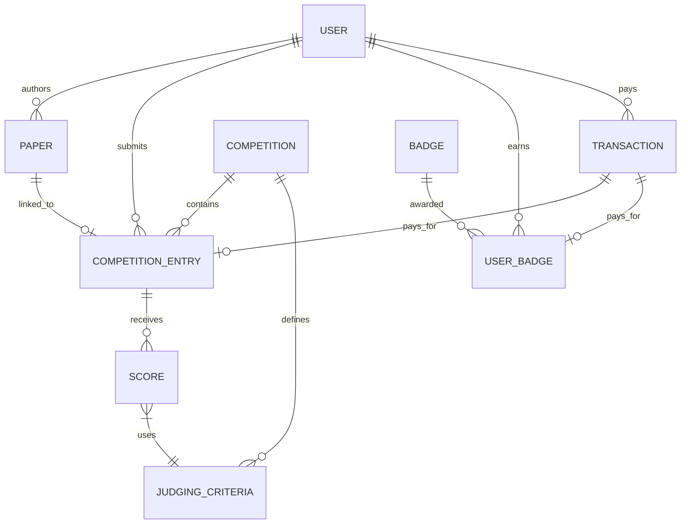

# Research Report: Futuristic Modular Backend Architecture

- **Author**: Gemini Flash Overpower (Futuristic Database Architect)
- **Target**: Philosophid Platform
- **Date**: 2026-03-25
- **Status**: Finalized (Research)

## 1. Overview
This report outlines the strategy for migrating the current monolithic `schema.prisma` into a scalable, domain-driven modular architecture. The design focuses on flexibility between independent publications and competition entries, robust gamification, and a gateway-agnostic financial system.

## 2. Modular Prisma Strategy
We will leverage Prisma's **Schema Folder** feature (available in v5.15+ and generally available in v6). 

### Setup Plan:
1. Create a `prisma/schema/` directory.
2. Move global configurations into `prisma/schema/_config.prisma`.
3. Split models into logical domain files:
   - `user.prisma`: Identity, Profile, and Activity.
   - `publication.prisma`: Core content (Articles, Stories, Essays).
   - `competition.prisma`: Competitions, Submissions, Scoring, and Prizes.
   - `gamification.prisma`: Badges, XP, and Levels.
   - `financial.prisma`: Transactions, Payments, and Invoices.

## 3. Futuristic Database Model Design

### 3.1 Core Architecture (ERD)

### 3.2 Domain Breakdowns

#### A. User & Profile (`user.prisma`)
- **Focus**: High performance retrieval and public profile mapping.
- **Key Fields**:
    - `username`: String (Unique, Indexed) - Vital for `/{username}` routing.
    - `email`: String (Unique)
    - `name`: String?
    - `birthday`: DateTime? (Age is calculated, not stored).
    - `bio`: Text
    - `institution`: String?
    - `avatarUrl`: String?
    - `totalXp`: Int (Default 0)
    - `level`: Int (Default 1)

#### B. Publication (`publication.prisma`)
- **Focus**: Decoupled content that can exist independently OR as a submission.
- **Key Fields**:
    - `type`: `ARTICLE` | `SHORT_STORY` | `LONG_ESSAY`
    - `status`: `DRAFT` | `PUBLISHED` | `ARCHIVED`
    - `isCompetitionEntry`: Boolean (Flag for filtering independent vs entry)

#### C. Competition & Submission (`competition.prisma`)
- **Focus**: Multi-round judging and prize management.
- **Entities**:
    - `Competition`: Metadata, Fees, Dates.
    - `CompetitionSubmission`: Junction between User, Paper, and Competition.
    - `JudgingCriteria`: Define what is scored (e.g., "Clarity", "Originality").
    - `Score`: The actual rating given by judges per criteria.

#### D. Gamification (`gamification.prisma`)
- **Focus**: Retention and social proof.
- **Entities**:
    - `Badge`: Metadata for achievements.
    - `UserBadge`: When and why it was earned.
    - `LevelDefinition`: XP thresholds for "Apprentice", "Philosopher", "Sage".

#### E. Financial (`financial.prisma`)
- **Focus**: Audit-trail integrity and gateway abstraction.
- **Entities**:
    - `Transaction`: `amount`, `status` (`PENDING`, `SUCCESS`, `FAILED`), `gatewayRef`.
    - `PaymentMethod`: Store tokens for recurring or easy future checkouts (Midtrans/Stripe).

## 4. Scalability & Future-Proofing

1.  **Payment Agnosticism**: The `Transaction` model uses a `metadata` JSON field and a `gatewayRef`. This allows switching from Midtrans to Stripe or others without schema changes.
2.  **Scoring Flexibility**: By using a `Score` table linked to `JudgingCriteria`, we can add new ways to grade essays (e.g., Community Vote vs Judge Score) without altering the `Paper` or `Competition` models.
3.  **Modular Growth**: If we add a "Social" or "Forums" feature, we simply add a `social.prisma` file.

## 5. User Profile Cleanup Recommendations
- **Remove `age`**: Calculate dynamically using `TODAY - birthday` to ensure accuracy over time.
- **Add `username`**: This MUST be unique and sanitized (no spaces, URL-safe) for the public profile feature.
- **Unify Scores**: Decouple "User Platform Score" (XP) from "Competition Entry Score".

## 6. Implementation Checklist for Task 5
1. [ ] Create `prisma/schema` folder.
2. [ ] Enable `prismaSchemaFolder` in `generator`.
3. [ ] Perform modular split (Copy-Paste-Refactor).
4. [ ] Run `npx prisma generate`.
5. [ ] Create a migration for the new structure (careful with data preservation).

---
**Prepared for Task #5 Implementation.**
